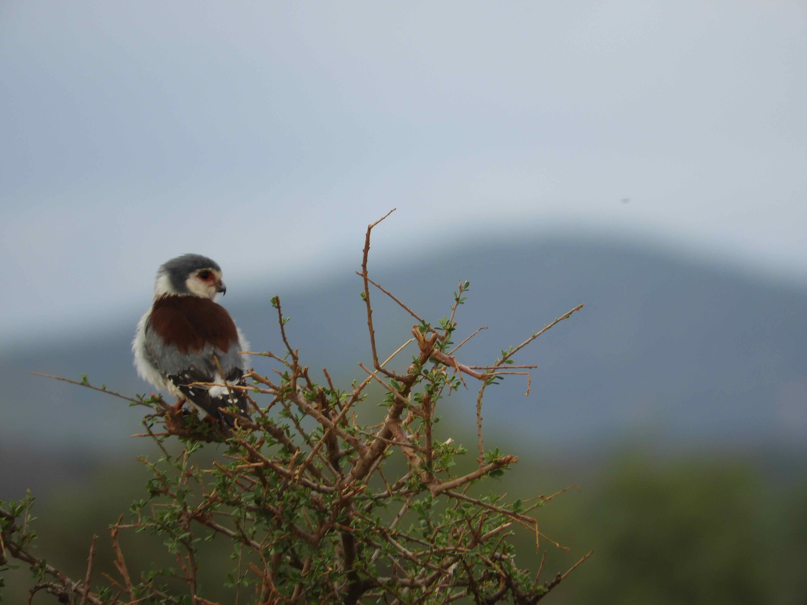
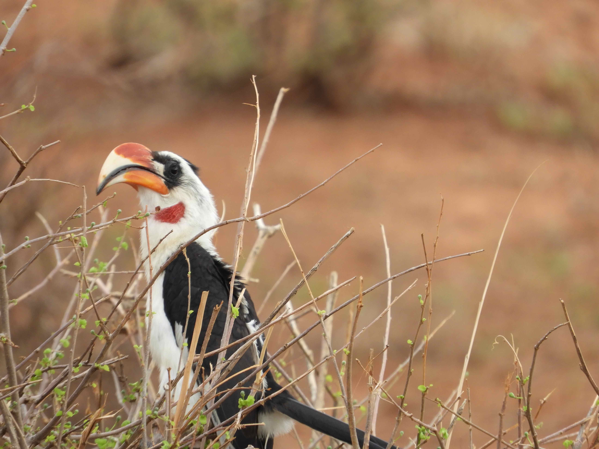
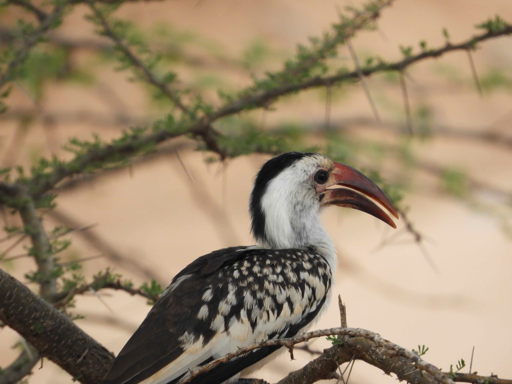
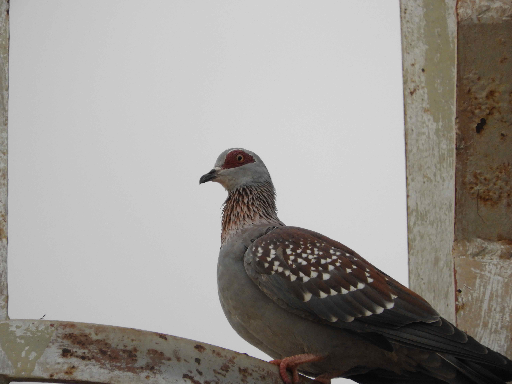
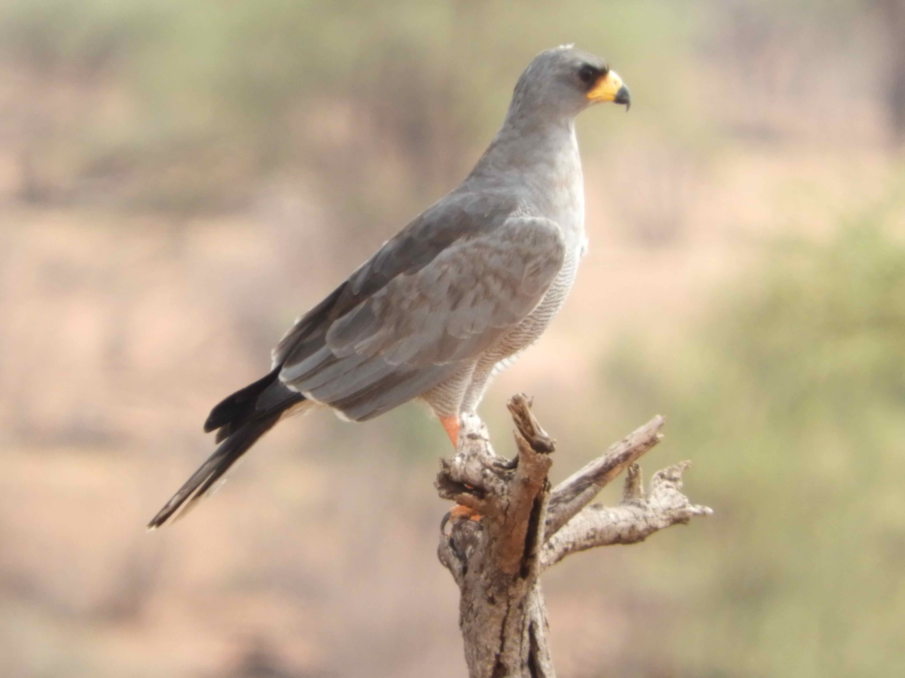
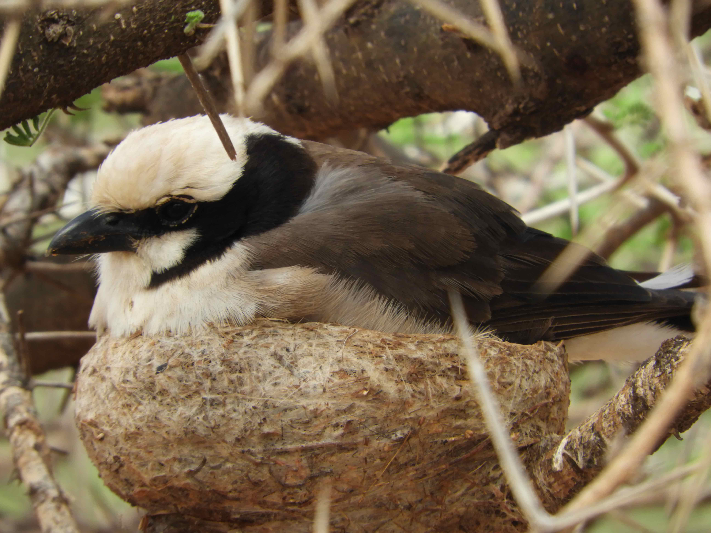
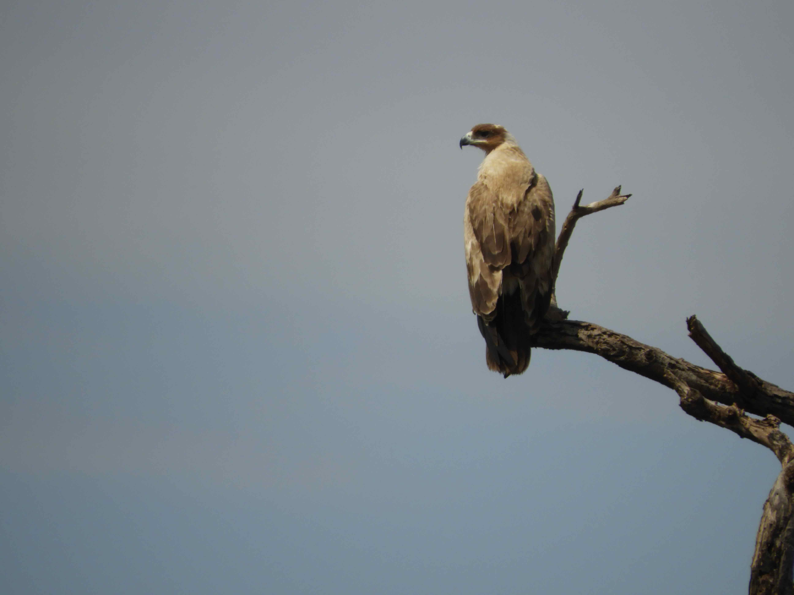
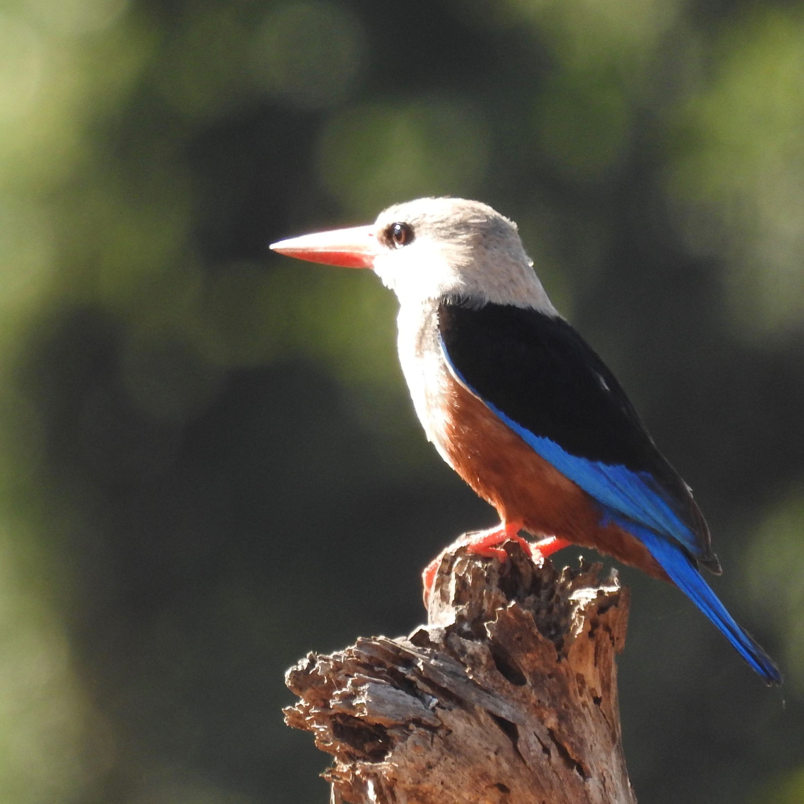
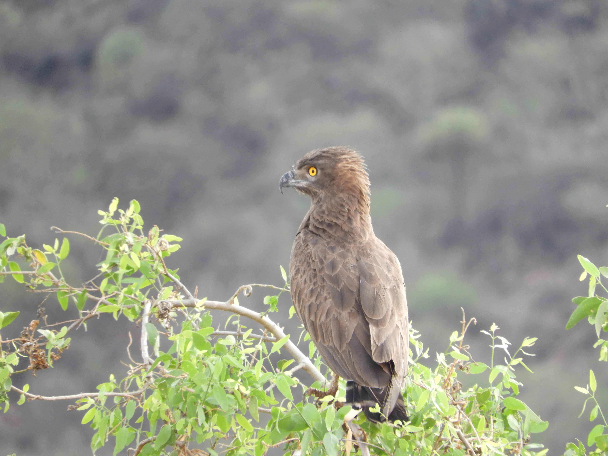

# Pictures of birds

This section contains some of my pictures of birds across Kenya. 

```{r include=FALSE, echo=FALSE}
library(tidyverse)
library(readxl)
library(xtable)

```


## Pygymy Falcon



## Von der Decken's Hornbill



## Red-billed Hornbill




## Speckled Pigeon




## Eastern Chanting-Goshawk



## Northern White Crowned Shrike


## Steppe Eagle



## Grey Headed Kingfisher



## Brown Snake Eagle



