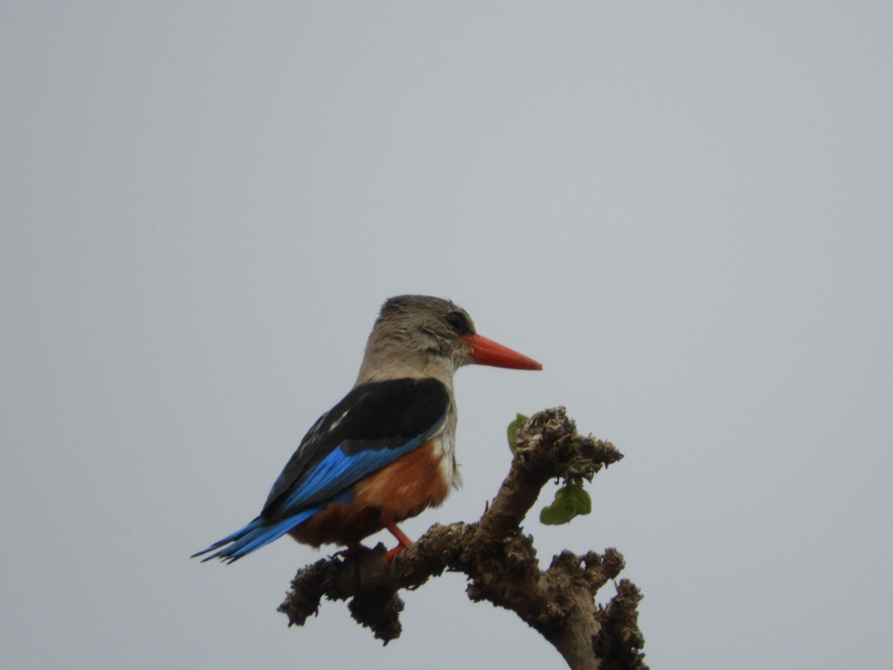
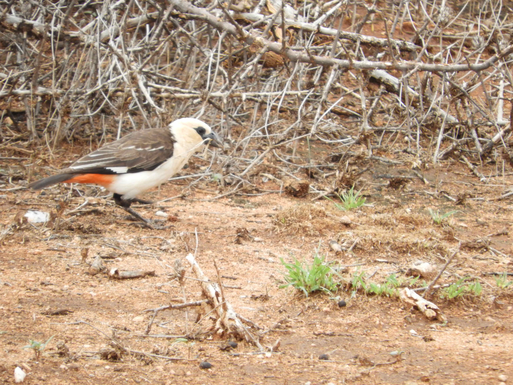
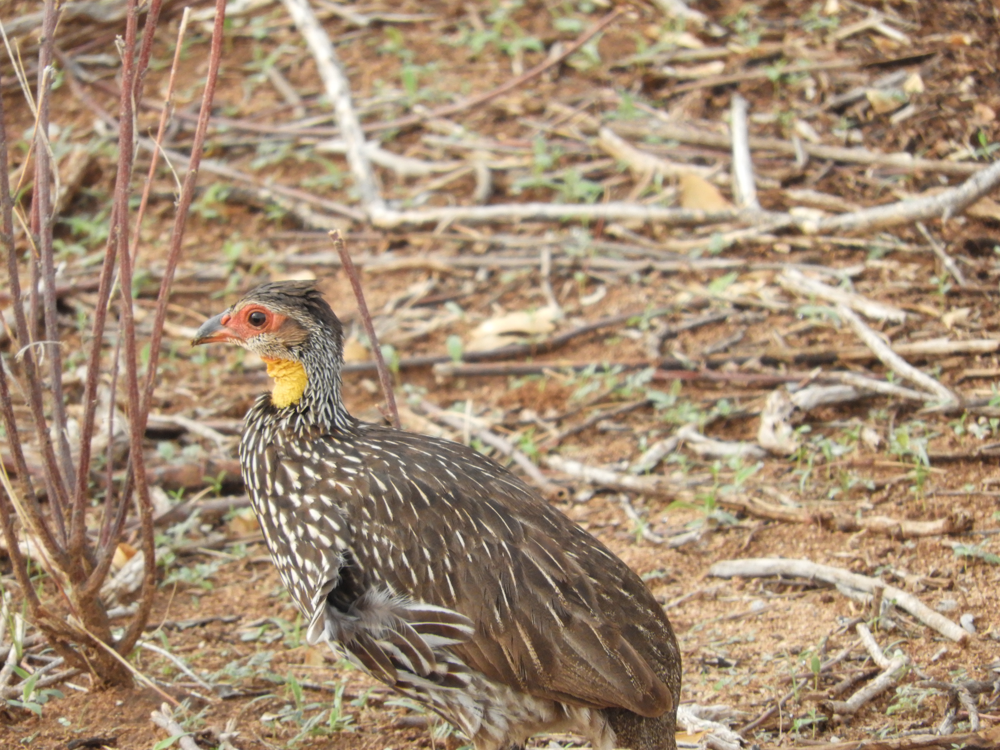

# Pictures of birds

This section contains some of my pictures of birds across Kenya. 

```{r include=FALSE, echo=FALSE}
library(tidyverse)
library(readxl)
library(xtable)

```


## Pygymy Falcon


## Von der Decken's Hornbill


## Red-billed Hornbill


## Vulturine Guineafowl


## Red-billed Hornbill Pair


## Speckled Pigeon


## Eastern Chanting-Goshawk


## Northern White Crowned Shrike


## Steppe Eagle


## Grey Headed Kingfisher



## Brown Snake Eagle


## White Headed Buffalo Weaver



## African Hoopoe


## Laughing Dove


## Superb Starling


## White Bellied Go Away Bird


## Long Crested Eagle


## Yellow-Necked Spurfowl




